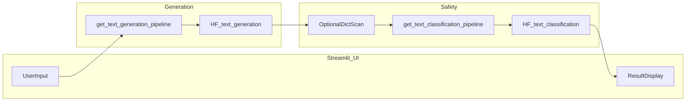

# 中文游戏 UGC 应用：总功能流程

本文档描述端到端业务流程、系统模块划分与数据流，适用于课程项目中的「逻辑与架构」说明章节。

**仓库目录与 Canvas 打包方式**见 [00_项目文件架构与提交映射.md](00_项目文件架构与提交映射.md)（依据 [ISOM5240_project_requirements.pdf](../ISOM5240_project_requirements.pdf)）。

---

## 1. 场景与目标

- **场景**：用户在游戏 UGC 场景下需要快速产出中文文本（如装备描述、公会公告、角色台词草稿、聊天内容草稿等）。
- **目标**：
  1. 通过 **文本生成** 根据用户提示生成中文内容；
  2. 对生成结果自动进行 **敏感词 / 有毒内容检测**，给出可解释的提示（通过、警告或建议修改）。
- **原则**：生成模型不单独承担最终合规责任；**必须通过第二个模型（文本分类）与可选规则层** 做检测后再展示结论。

---

## 2. 用户故事（主流程）

1. 用户在界面中输入 **提示词（prompt）** 与可选生成参数（如最大生成长度、随机性等）。
2. 系统调用 **Text Generation** 模块，返回一段中文文本。
3. 系统将上述文本送入 **内容安全检测** 模块：
   - 可选：敏感词词典快速扫描；
   - 必选：基于微调分类模型的 **Text Classification**，输出标签与置信度。
4. 系统聚合结果并展示：
   - 生成正文；
   - 检测结果（例如：无毒 / 有毒、分数、命中关键词说明）；
   - 若未通过检测，给出简要说明，便于用户改写提示或内容。

---

## 3. 系统架构与模块关系

建议实现为 **Streamlit 单页应用**（`app.py`），内部逻辑拆分为清晰的函数或小模块，避免过度工程化。

**与 ISOM5240 要求对应**（详见课程 PDF）：

- **至少两个 Hugging Face `pipeline`**，且均使用 **Hugging Face 平台提供的预训练模型**（禁止使用 OpenAI 等来源）。
- 本课题推荐组合：`text-generation`（中文预训练因果语言模型，可 **不微调**）+ `text-classification`（在 Chinese-toxic 类数据上 **微调** 的检测模型）。课程说明「每位学生一个主目标、仅微调一个模型」时，建议将 **微调对象定为分类模型**；生成侧作为第二个 pipeline 满足「双 pipeline」要求。
- **App 与 Notebook 一致**：Streamlit 加载的分类权重须与 Colab/Notebook 微调产出 **一致**（本地 `models/finetuned/` 或 Hub 上同一模型），否则按 PDF 说明会扣分。
- 两个 pipeline 均建议 **懒加载**（见下文「实现与代码规范对齐」），与参考 Notebook 一致。

**报告中的模型结构图（建议）**：与 PDF 示例「多阶段 pipeline」同理，可画为：**用户 prompt → Text Generation（HF）→ 生成文本 → Text Classification（微调）→ 标签/分数（+ 可选词典）→ Streamlit 展示**。

---

## 4. 数据流说明

| 阶段 | 输入 | 输出 |
|------|------|------|
| 生成 | `prompt`（字符串）、`max_new_tokens`、`temperature` 等 | `generated_text`（字符串）、可选耗时 |
| 词典扫描（可选） | `generated_text`、词表 | 是否命中、命中词列表（若有） |
| 分类检测 | `generated_text` | `label`、`score`（及多标签时的策略说明） |
| 展示 | 上述各步结果 | 合并后的 UI 展示与提示文案 |

**接口约定（逻辑层）**：

- 生成模块向检测模块传递 **纯文本字符串**，不隐含副作用；
- 检测模块不修改原文，仅返回结构化结果，由 UI 决定如何标红或拦截。

---

## 5. 非功能需求（简要）

- **延迟与资源**：生成与分类均为推理任务；首次运行需下载模型，应在 UI 中用 `st.info` / `st.warning` 提示耗时。
- **可复现性**：Notebook 中训练与实验需固定随机种子；App 端可对生成设置 `seed`（若所用模型与 pipeline 支持）。
- **错误处理**：空输入、模型加载失败、网络问题等应有友好提示（见执行指南中 Streamlit 规范）。

---

## 6. 实现与代码规范对齐

**权威约束**：实现须遵守仓库根目录 [执行指南_代码生成规范.md](../执行指南_代码生成规范.md)；代码风格对齐 [DL_NIJIALU_21237096.ipynb](../DL_NIJIALU_21237096.ipynb)。

与本总流程直接相关的条目摘录：

1. **学生向代码**：以可读为主，避免元类、复杂装饰器、深度嵌套推导式、异步框架等；优先显式步骤与中间变量。
2. **双 pipeline 懒加载**：例如 `_text_gen_pipe = None`、`get_text_generation_pipeline()`；`_toxic_cls_pipe = None`、`get_text_classification_pipeline()`，按需加载、可复用参考 Notebook 中的模式。
3. **仅使用 Hugging Face** 预训练与微调资源；不使用 OpenAI 等课程未推荐来源。
4. **Streamlit 结构**：`app.py` 中分区为常量配置、`get_*_pipeline`、推理函数、页面布局；使用 `st.error` / `st.warning` / `st.info`；对用户输入做非空等校验。
5. **文档与评分**：逻辑上保持「数据 → 模型 → 实验 → 应用」清晰可追溯，便于写入项目报告中的 Logical Approach 与 Documentation 部分。

---

## 7. 项目文件架构与交付物（ISOM5240）

本地开发推荐布局与 **Canvas zip 内文件夹** 的一一对应关系（含 `Python_notebooks/`、`GitHub_App_Files/`、`Dataset_files`、`Fine-tuned_Model_files`、`documentation`、`presentation`）见 **[00_项目文件架构与提交映射.md](00_项目文件架构与提交映射.md)**。

**与本流程直接相关的交付物摘要**：

| 交付物 | 说明 |
|--------|------|
| `notebooks/*.ipynb` | 微调 + 实验；须能通过 **Restart & Run All**，输出与报告一致 |
| `app/app.py` 等 | Streamlit Cloud 部署；内含两个 HF pipeline |
| `data/` | 数据集文件或复现说明 |
| `models/finetuned/` | 提交用微调权重，与 Notebook / App 一致 |
| `documentation/Project_report.pdf` | &lt;10 页，章节见 PDF |
| `documentation/Experimental_results.xlsx` | 全部实验，样本量合理 |
| `presentation/` | PPT + `grpXX.mp4`（两位数组号） |
| 三个 URL | **Model（HF）**、**App（Streamlit Cloud）**、**GitHub** — 写入报告 |

---

## 8. 与其他设计文档的关系

| 文档 | 内容 |
|------|------|
| [00_项目文件架构与提交映射.md](00_项目文件架构与提交映射.md) | 目录结构、与 Canvas 打包映射、提交自检 |
| [02_text_generation.md](02_text_generation.md) | 生成子系统功能与参数说明 |
| [03_文本敏感词与有毒内容检测.md](03_文本敏感词与有毒内容检测.md) | 检测子系统（词典 + 分类） |
| [04_分类模型微调与实验计划.md](04_分类模型微调与实验计划.md) | 数据集、微调、验证指标与实验报告结构 |

**实验结论回填**：系统级结论（例如「微调后误报率变化」）应在完成 [04](04_分类模型微调与实验计划.md) 后，写入 `Project_report.pdf` 的 **Conclusion** 与 **Experiments** 小节，并与 `Experimental_results.xlsx` 一致。

---

## 9. ISOM5240 对照自检清单（摘自作业 PDF）

撰写报告与打包提交前建议逐项核对（措辞以 [ISOM5240_project_requirements.pdf](../ISOM5240_project_requirements.pdf) 为准）：

**报告（Project_report.pdf）**

- [ ] 题目与学生姓名；**公司名称与官网 URL**
- [ ] Project Objective（≤50 词，深度学习导向）
- [ ] Strategy；**Model URL**（HF 微调模型）；**App URL**（Streamlit Cloud）；**GitHub URL**
- [ ] Dataset：标签数、特征、训练/验证/测试样本量、来源 URL
- [ ] Model：HF 预训练 + 微调模型名称；**结构图**（本课题：生成 → 分类检测）
- [ ] Deployment：Streamlit Cloud **截图与说明**
- [ ] Experiments：（i）模型选型：**准确率 + 运行时间**；（ii）Cloud 应用：**准确率**；探索过哪些模型、如何得到最终 pipeline；**表格 + 合理测试样本量**
- [ ] Conclusion：是否解决业务问题、如何落地应用

**其他文件**

- [ ] `Python_notebooks/`：含微调与实验 Notebook，**Restart & Run All** 通过且保留输出
- [ ] `GitHub_App_Files/`：`app.py`、`requirements.txt` 等齐全
- [ ] 数据集文件夹含复现所需数据或等价说明
- [ ] **Fine-tuned_Model_files** 与 App、Notebook **一致**
- [ ] `Experimental_results.xlsx` 记录全部实验
- [ ] 演示 PPT + mp4（脸部可见）；视频命名 `grpXX.mp4`
- [ ] zip 命名：`GroupXX_组长学号.zip`；仅最后一次提交有效

**技术约束（PDF Important Notes）**

- [ ] 至少 **2 个** HF `pipeline`；预训练模型 **仅来自 Hugging Face**
- [ ] 未使用 OpenAI 等禁用来源；大型 LLM 课题需事先与教授沟通（本方案宜用 **中小模型**）

**评分维度关联（Rubric 摘要）**：Business Application、Model（效率/效果/适用性）、Expected Results、Coding（Python / Logical / Error-Free）、Documentation & Presentation —— 本文档流程应能在报告中映射到 **Logical Approach** 与 **Design and Implementation of Business Application**。
