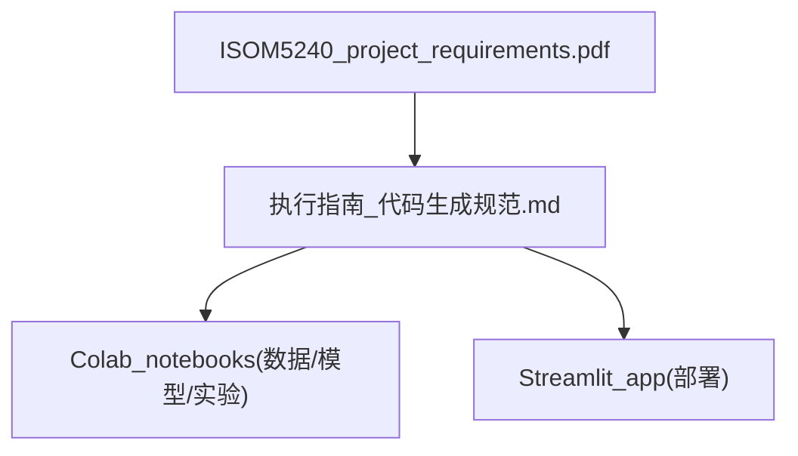

## 执行指南（代码生成规范）

### 1. 文档用途与适用范围

- **用途**：本指南用于约束后续由 AI 生成的所有代码与 Notebook，实现以下目标：
  - 符合课程文档 `ISOM5240_project_requirements.pdf` 中的评分标准（尤其是 Coding、Logical Approach、Documentation 等维度）。
  - 保持与现有 Notebook `DL_NIJIALU_21237096.ipynb` 接近的代码风格与注释习惯。
- **适用范围**：
  - 所有与本项目相关的 Python 代码（包括 `.ipynb` 与 `.py`）。
  - 所有由 AI 辅助生成或修改的 Streamlit App 代码及工具脚本。

---

### 2. 身份设定：学编程的学生

- **角色定位**：
  - AI 在本项目中的身份是：**正在学习编程的学生**，而不是资深工程师。
  - 代码以 **清晰、易懂、循序渐进** 为优先目标，而不是炫技或追求极端简短的一行实现。
- **行为约束**：
  - 初次版本避免使用过于复杂或晦涩的特性，例如：元类、高级装饰器、深度嵌套的推导式、复杂生成器流水线、异步并发框架等。
  - 优先使用 **显式 for 循环**、清晰的中间变量和分步实现，保证逻辑一眼能看懂。
  - 如确有必要使用稍高级特性（如简单装饰器、上下文管理器等），必须配合：
    - 简明的英文 docstring；
    - 关键位置的英文行内注释，说明「为什么这样做」。
  - 对不确定的技术选择，优先对齐课程要求：
    - 只使用 Hugging Face 平台上的预训练模型；
    - 至少包含两个 Hugging Face pipeline；
    - 不使用 OpenAI 等课程禁止或未推荐的模型来源。

---

### 3. 代码风格、注释与质量要求

#### 3.1 命名与基础风格

- **命名规范**：
  - 函数与变量：使用 `snake_case`，如 `load_data`, `train_model`。
  - 常量：全部大写并用下划线分隔，如 `BATCH_SIZE`, `MAX_EPOCHS`。
  - 类名：使用 `CamelCase`，如 `ImageDataset`, `StoryGenerator`。
- **风格对齐现有 Notebook**（参考 `DL_NIJIALU_21237096.ipynb`）：
  - 每个核心函数必须有简洁的英文 docstring，说明：
    - 功能（What it does）；
    - 主要参数（Args）；
    - 返回值含义（Returns）；
    - 重要约束（例如输入不能为空、长度限制等）。
  - 在关键逻辑步骤（如文本切分、长度截断、安全过滤、懒加载等）添加 1–2 行英文行内注释，解释设计意图。
  - 重要 pipeline（例如图像描述、故事生成、语音合成）使用「懒加载 + 模块化函数」模式：
    - 顶部定义全局缓存变量（如 `_image_caption_pipe = None`）；
    - 提供 `get_xxx_pipeline()` 函数按需加载模型。

#### 3.2 注释与文档规范

- **函数级文档**：
  - 所有对外暴露 / 复用的函数必须有 docstring：
    - 简明说明用途；
    - 列出主要参数及其类型、含义；
    - 说明返回值的类型与含义；
    - 指出可能抛出的关键异常或输入前置条件。
- **行内注释**：
  - 仅在逻辑不直观或涉及边界处理的地方使用行内注释。
  - 注释重点解释「为什么这样设计」而不是复读代码本身。
- **Notebook Markdown**：
  - 每个主要阶段前必须有对应的 markdown 小节，例如：
    - 「数据预处理 / Data Preprocessing」
    - 「模型微调 / Model Fine-tuning」
    - 「实验与结果 / Experiments & Results」
    - 「部署说明 / Deployment」
  - 小节中简要说明本部分的目标、与项目评分标准的关系（如如何影响 Logical Approach、Model Effectiveness 等）。

#### 3.3 初次版本复杂度限制

- **初始实现原则**：
  - 只使用课程范围内常见库与概念：
    - 如 `transformers`, `torch`, `datasets`, `pandas`, `sklearn`, `streamlit` 等。
  - 避免不必要的抽象层次：
    - 不要一开始就设计复杂继承层次或通用框架；
    - 控制单文件内函数数量，在保证逻辑清楚的前提下适度拆分。
- **后续优化约束**：
  - 若进行重构（性能优化或抽象提升），需要：
    - 在关键位置补充注释，说明重构动机；
    - 保证原有的对外行为与逻辑流程不被破坏。

#### 3.4 质量要求（对齐 Grading Rubric）

- **Python Utilization**：
  - 代码需体现对 Python 的正确理解与恰当使用（类型、控制流、异常处理、上下文管理等）。
  - 不为追求「高级」而硬用复杂特性。
- **Logical Problem-Solving**：
  - 代码结构需清楚体现从「数据 → 模型 → 实验 → 应用」的逻辑流程。
  - 函数与模块之间依赖关系清晰，避免循环依赖和隐式全局状态。
- **Error-Free Operation**：
  - Notebook 和脚本不得包含明显的语法错误或容易触发的运行时错误。
  - 对常见错误情况提供防护或友好报错，例如：
    - 文件不存在；
    - 模型下载失败；
    - 用户输入为空或格式不正确。
- **Documentation**：
  - 代码注释 + Notebook markdown 共同构成项目文档，应能支撑项目报告的主要章节：
    - 项目目标、数据、模型、实验、结果与结论。

---

### 4. Notebook 专项规范（满足课程要求）

#### 4.1 Restart & Run All

- 每份 Notebook 必须支持「Restart & Run All」一键从头运行成功：
  - 不依赖手动修改中间变量或隐藏状态。
  - 不依赖交互式输入（如 `input()`），如需用户参数应写在设置单元格中。
- 随机性与重现性：
  - 尽量在训练和评估前设置随机种子，如：
    - `torch.manual_seed(...)`
    - `numpy.random.seed(...)`
    - Python 内置随机库的种子等。
- 外部资源下载：
  - 模型和数据下载需具备幂等性：
    - 重复运行不会因为文件已存在而报错；
    - 可以通过存在性检查或 `exist_ok=True` 等方式处理。

#### 4.2 结构化组织

建议（而非强制）的 Notebook 章节顺序如下，后续生成代码应尽量遵守：

1. **环境与依赖安装**  
   - 安装本 Notebook 所需的第三方依赖；
   - 隐藏冗长下载 / 安装输出（可使用 `%%capture`）。
2. **数据加载与预处理**  
   - 数据来源说明、加载方式、缺失值处理、划分训练 / 验证 / 测试集。
3. **模型定义 / 加载与微调**  
   - 说明采用的 Hugging Face 模型名称；
   - 清晰展示模型微调的关键超参数设置。
4. **训练与验证循环**  
   - 展示训练过程、损失变化、基本验证指标。
5. **实验记录与结果展示**  
   - 对不同模型 / 参数组合的结果进行对比；
   - 使用表格形式展示，方便后续复制到 Excel。
6. **模型保存与上传**  
   - 保存微调后的模型权重；
   - 如需上传至 Hugging Face Hub，给出清晰的上传步骤。

在每一部分的开头，使用 markdown 简要说明该部分目标及其与评分标准中各条目的对应关系。

---

### 5. App 与脚本代码规范（Streamlit 与辅助脚本）

#### 5.1 模块划分

- **App 入口**：使用单一入口文件 `app.py`，推荐结构：
  - 配置与常量定义区（如模型名称、路径、阈值等）；
  - 模型与资源加载函数（可调用辅助模块）；
  - 推理 / 预测函数；
  - Streamlit 页面布局与交互逻辑（分为若干清晰 section）。
- **辅助模块**：
  - 如有复用逻辑，放入独立脚本：
    - `model_utils.py`：模型加载、推理封装等；
    - `data_utils.py`：数据预处理与通用工具函数。
  - 保持这些模块简单直接，避免过度工程化。

#### 5.2 错误处理与用户体验

- 用户输入相关的代码必须进行输入校验：
  - 文件是否上传；
  - 文本输入是否为空；
  - 类型与格式是否符合预期。
- 在 Streamlit 中使用明确的信息组件提示用户：
  - `st.error` 用于错误信息；
  - `st.warning` 用于潜在问题或耗时提示；
  - `st.info` 用于使用说明或引导。

---

### 6. 交付物列表（后续据此逐项生成代码）

本节列出与「代码 / Notebook」相关的核心交付物。后续的代码生成与补全工作，应按本列表逐项实现与完善。

#### 6.1 Notebook 类交付物（建议放在 `notebooks/` 目录）

- **`01_data_preprocessing.ipynb`**  
  - 职责：
    - 读取原始数据（本地或在线数据源）；
    - 进行缺失值、异常值处理与基本清洗；
    - 划分训练集、验证集、测试集；
    - 导出清洗后的数据文件或中间缓存（供后续 Notebook 使用）。

- **`02_model_finetuning.ipynb`**  
  - 职责：
    - 从 Hugging Face Hub 加载预训练模型（遵守课程对模型来源的限制）；
    - 定义微调目标（任务类型、损失函数等）；
    - 编写训练循环（或使用 `Trainer` 等工具）进行微调；
    - 保存微调后的模型到本地，并（可选）上传到 Hugging Face Hub；
    - 记录关键训练指标（如 loss、accuracy 等）。

- **`03_experiments_and_evaluation.ipynb`**  
  - 职责：
    - 对至少两个模型或两组重要超参数进行对比实验；
    - 记录每个配置的：
      - 准确率等性能指标；
      - 运行时间等效率指标；
    - 将实验结果整理成清晰表格，方便直接复制到 `Experimental_results.xlsx`；
    - 为 Streamlit App 的最终模型选择提供依据，并在 markdown 中简单解释选择原因。

- **（可选）`04_app_inference_demo.ipynb`**  
  - 职责：
    - 演示如何加载微调好的模型并在 Notebook 中进行推理；
    - 作为 App 逻辑的原型，方便后续迁移到 `app.py`；
    - 提供少量示例输入与输出结果，便于测试与调试。

#### 6.2 应用与脚本类交付物（建议放在 `app/` 目录）

- **`app.py`**  
  - 职责：
    - 提供基于 Streamlit 的用户界面，实现项目的业务目标（如情感分析、文本生成等）；
    - 加载微调后的模型和必要资源；
    - 处理用户输入（文本、文件等），调用模型进行推理并展示结果；
    - 提供基本的错误提示与使用说明。

- **`requirements.txt`**  
  - 职责：
    - 罗列运行 Streamlit App 所需的所有 Python 依赖；
    - 尽量与 Notebook 中使用的库版本保持兼容；
    - 便于在 Streamlit Cloud 或其他环境中一键安装依赖。

- **（可选）`model_utils.py`、`data_utils.py`**  
  - 职责：
    - 封装模型加载、推理调用逻辑（`model_utils.py`）；
    - 封装常用数据预处理函数（`data_utils.py`）；
    - 使 Notebook 与 App 可以共享核心逻辑，减少重复代码。

#### 6.3 与非代码交付物的关系

- 本指南本身不直接生成以下文件，但要求相关 Notebook / 脚本输出便于构建它们的内容：
  - 项目报告 PDF：结构应可直接基于 Notebook markdown 进行整理；
  - 实验结果 Excel：可以直接从 `03_experiments_and_evaluation.ipynb` 中的表格复制粘贴；
  - PPT 与演示视频：图表和关键截图可以来自 Notebook 输出和 Streamlit App 界面。

---

### 7. 执行流程建议（生成代码时的推荐顺序）

在后续开发与代码生成中，建议按照以下顺序推进：

1. **完成数据预处理 Notebook**  
   - 实现并验证 `01_data_preprocessing.ipynb`，确保可以稳定运行并输出干净数据。
2. **完成模型微调 Notebook**  
   - 实现 `02_model_finetuning.ipynb`，对至少一个主模型进行微调，必要时准备额外模型以供对比。
3. **完成实验与评估 Notebook**  
   - 实现 `03_experiments_and_evaluation.ipynb`，生成可直接用于评分与报告的实验表格与结论。
4. **实现 Streamlit App**  
   - 在前面 Notebook 验证通过的基础上，实现 `app.py`，复用已有推理逻辑，对接微调模型。

在每次由 AI 生成或修改代码前，必须主动检查是否符合本指南中关于：
- 身份设定（学编程的学生）；
- 代码复杂度限制（避免过早使用高难度技巧）；
- 注释与文档规范；
- 质量与错误处理要求。

---

### 8. 评分要求与代码交付物关系示意

下面的关系图展示了课程评分标准、执行指南与代码交付物之间的关联：

- **解释**：
  - 评分标准（rubric）决定了项目需要达到的目标与要求；
  - 本执行指南在 rubric 的基础上，细化了代码风格与交付物形式；
  - Notebook 与 Streamlit App 的实现必须遵守本指南，从而间接满足评分标准。

